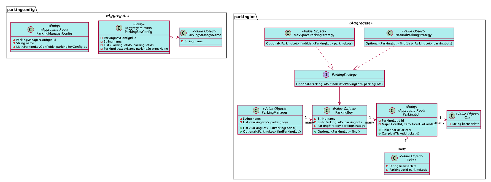

# parking-lot-ddd-workshop

## Class UML Graph



## Start Application

```sh
./gradlew build
./gradlew bootRun
```


## Basic Data

* Basic Data Class(ParkingBoyMemRepository, ParkingLotMemRepository)

* Basic Data
"BOY001" -> "LOT001"(capacity: 3)
         -> "LOT002"(capacity: 4)

## Function

visit [http://localhost:8080/swagger-ui.html](http://localhost:8080/swagger-ui.html)

### parking
POST /parking-lot/parking

Request Body Example:
```json
{
  "carLicensePlate": "川A32768"
}
```

Response Example：
```json
{
  "ticketId": "def9b88ae7d8487a8a3cd55d698f9303",
  "carLicensePlate": "川A32768",
  "parkingLotId": "LOT001"
}
```

### picking
POST /parking-lot/picking

Request Body Example:
```json
{
  "parkingLotId": "LOT001",
  "ticketId": "def9b88ae7d8487a8a3cd55d698f9303"
}
```

Response Example：
```json
{
  "carLicensePlate": "川A32768"
}
```