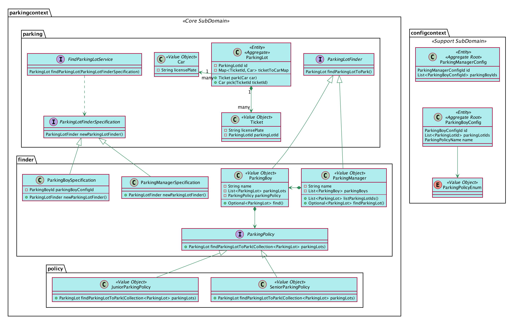
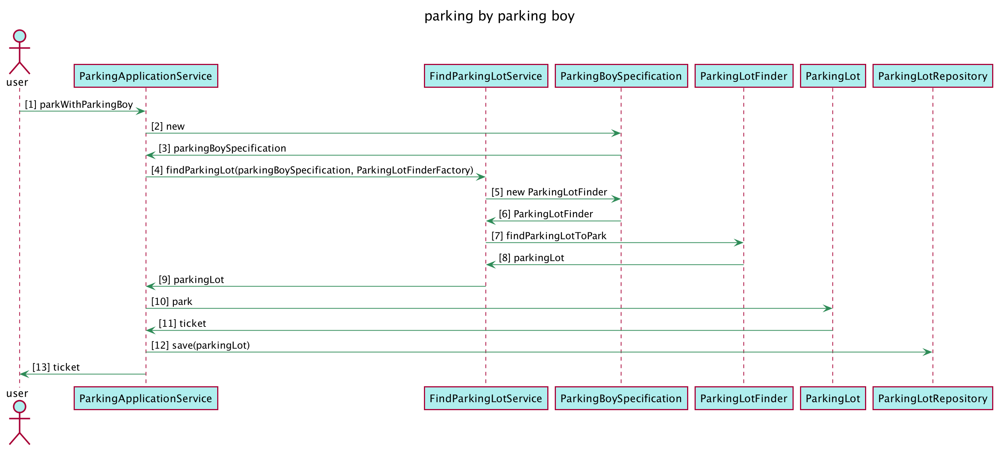

# parking-lot-ddd-workshop

## Setup Development Environment
```shell script
npm install
```

## Start Application

```sh
./gradlew build
./gradlew bootRun
```

## Domain Model UML Graph


## Sequence UML Graph



## commit style

](http://commitizen.github.io/cz-cli/)
](https://conventionalcommits.org)
